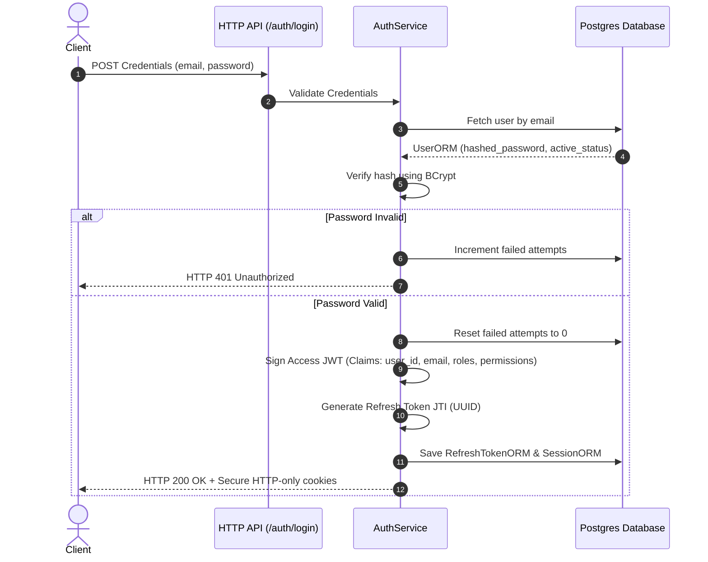
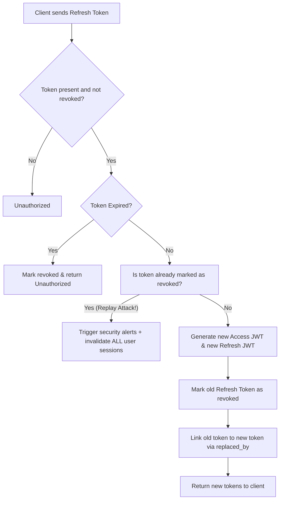

# Security and Authentication Review (Stage 3)

This document provides a comprehensive security review and architectural guide for the Identity & Access Management (IAM) module implemented in Stage 3.

---

## 1. Authentication Flows & JWT Lifecycle

The platform implements a stateless JWT-based authentication pattern combined with stateful token and session tracking in the PostgreSQL database.



### Access Token Lifecycle
- **Type**: Signed JSON Web Token (JWT) using HMAC-SHA256 (`HS256`).
- **Lifespan**: 15 minutes (defined via `settings.ACCESS_TOKEN_EXPIRE_MINUTES`).
- **Transmission**: Transmitted via HTTP `Authorization: Bearer <token>` header or `access_token` secure cookie.
- **Claims**:
  - `sub`: Unique User UUID.
  - `email`: User email address.
  - `roles`: String array representing active roles (e.g. `["CANDIDATE"]`).
  - `permissions`: String array representing granted permissions (e.g. `["users:view"]`).
  - `exp`: UTC Unix expiration timestamp.

---

## 2. Refresh Token Rotation (RTR) & Replay Mitigation

To mitigate token theft (where a malicious actor intercepts a refresh token and uses it to maintain access), the platform implements **Refresh Token Rotation (RTR)**.



### Replay Attack Remediation
If a refresh token is presented that has already been marked as `is_revoked = True` (e.g., from a cache replay or an intercepted token already rotated), the server flags this as a **CRITICAL Breach Anomaly**:
1. It immediately calls `revoke_refresh_tokens_for_user(user_id)` to revoke all refresh tokens associated with that user.
2. It deactivates all active device sessions in `user_sessions`.
3. It registers a critical security alert audit log.
4. It sends a security alert email to the user indicating a compromise attempt.

---

## 3. Database Schema

The IAM schema isolates auth entities completely from business entities (`recruiters`, `candidates`), linking profiles via a single nullable foreign key `user_id` pointing to `users.id`.

### Core Tables Summary

| Table Name | Column Name | Data Type | Key Type | Purpose |
|---|---|---|---|---|
| **`users`** | `id`<br>`email`<br>`password_hash`<br>`is_active`<br>`is_verified`<br>`failed_login_attempts`<br>`locked_until`<br>`deleted_at` | UUID<br>VARCHAR(255)<br>VARCHAR(255)<br>BOOLEAN<br>BOOLEAN<br>INTEGER<br>TIMESTAMP<br>TIMESTAMP | PK<br>Unique<br>-<br>-<br>-<br>-<br>-<br>- | Master accounts table. Contains credentials hashes, status flags, lockout timestamps, and soft deletes. |
| **`roles`** | `id`<br>`name`<br>`description` | UUID<br>VARCHAR(50)<br>TEXT | PK<br>Unique<br>- | Available system roles (`ADMINISTRATOR`, `RECRUITER`, `CANDIDATE`, `HIRING_MANAGER`). |
| **`permissions`** | `id`<br>`name`<br>`description` | UUID<br>VARCHAR(100)<br>TEXT | PK<br>Unique<br>- | Specific action permissions (`users:view`, `users:manage`, etc.). |
| **`user_roles`** | `user_id`<br>`role_id` | UUID<br>UUID | FK -> users<br>FK -> roles | Many-to-many junction table mapping roles to user accounts. |
| **`refresh_tokens`** | `id`<br>`user_id`<br>`token_hash`<br>`expires_at`<br>`is_revoked`<br>`replaced_by` | UUID<br>UUID<br>VARCHAR(255)<br>TIMESTAMP<br>BOOLEAN<br>UUID | PK<br>FK -> users<br>Unique<br>-<br>-<br>FK -> self | Tracks refresh token rotation lineage. Hashed for database security. |
| **`user_sessions`** | `id`<br>`user_id`<br>`session_key`<br>`ip_address`<br>`user_agent`<br>`is_active` | UUID<br>UUID<br>VARCHAR(255)<br>VARCHAR(45)<br>TEXT<br>BOOLEAN | PK<br>FK -> users<br>Unique<br>-<br>-<br>- | Active device log. Enables listing active sessions and remote logouts. |
| **`login_history`** | `id`<br>`user_id`<br>`ip_address`<br>`user_agent`<br>`status` | UUID<br>UUID<br>VARCHAR(45)<br>TEXT<br>VARCHAR(50) | PK<br>FK -> users<br>-<br>-<br>- | Audit history tracking failed/successful log entries. |
| **`audit_logs`** | `id`<br>`user_id`<br>`action`<br>`ip_address`<br>`details` | UUID<br>UUID<br>VARCHAR(100)<br>VARCHAR(45)<br>JSONB | PK<br>FK -> users<br>-<br>-<br>- | Secure, unmodifiable mutation ledger. |

---

## 4. Reusable Auth Module Layout

The IAM logic is modularized to avoid coupling:

```
services/common/auth/
├── __init__.py       # Exposes security and guard dependencies
├── security.py       # Password validation and BCrypt hashing logic
├── jwt_handler.py    # JWT Access/Refresh encode and decode utilities
└── permissions.py    # FastAPI dependencies: get_current_user, RequireRole, RequirePermission
```
