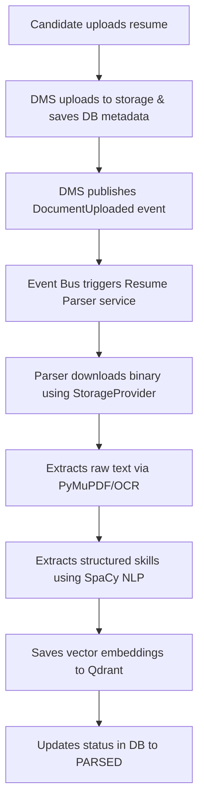

# Stage 5 Transition Plan: Resume Parsing & NLP Pipeline

This document details the transition and integration roadmap between the **Stage 4 Document Management System (DMS)** and the upcoming **Stage 5: Resume Parsing & NLP Pipeline**.

---

## 1. Context & Objectives

In Stage 5, the platform will start processing ingested files to extract intelligence:
- Parsing resumes (PDF, DOCX, TXT, Images) using OCR (Tesseract/PyMuPDF) and Natural Language Processing (NLP/SpaCy).
- Extracting candidate skills, experience blocks, education, and credentials into structured JSON metadata schemas.
- Storing high-dimensional skill embeddings inside the Qdrant Vector database to enable semantic matching.

The DMS acts as the single source of truth for raw document binaries and version metadata.

---

## 2. Event-Driven AI Pipeline Triggering

To keep services decoupled, the AI/ML parsing pipeline in Stage 5 will be triggered asynchronously via domain events:



### Integration Interface
Stage 5 services will fetch files directly via the storage abstraction layer:
```python
from services.common.storage import get_storage_provider
from app.adapter.db.document_repo import DocumentRepository

def process_resume_task(document_id: str, version_number: int, db):
    repo = DocumentRepository(db)
    storage = get_storage_provider()
    
    # 1. Fetch file version details
    db_ver = repo.get_version_by_number(document_id, version_number)
    if not db_ver:
         raise FileNotFoundError("Version not found.")
         
    # 2. Retrieve raw binary bytes
    file_bytes = storage.download_file(db_ver.storage_path)
    
    # 3. Pass bytes to Stage 5 extraction logic
    parsed_skills = ocr_and_extract_skills(file_bytes, db_ver.mime_type)
    # ...
```

---

## 3. Database Schema Extension for Stage 5

The parsing pipeline will associate extracted data back to documents and versions:

1. **Structured Skills Mapping**: Extracted details will be stored in a dedicated `parsed_resumes` table linked to the specific `document_versions.id` (retaining mapping accuracy when candidates upload new versions).
2. **Qdrant Vector Storage**: High-dimensional embeddings representing extracted skills will be saved in the `candidates` collection in Qdrant, keyed by the candidate's `user_id`.

---

## 4. Key Security & Quality Focuses in Stage 5

1. **Sandboxed OCR Engines**: Document parsing and conversion utilities (e.g. PyMuPDF, pdf2image, docx2txt) can be vulnerable to exploit payloads. Parsing tasks should run under sandboxed subprocess limits inside isolated worker containers.
2. **Deterministic Hashing Integrity**: Hashing calculations from Stage 4 (SHA-256) will verify that workers are parsing exact document copies, preventing caching mismatch bugs.
