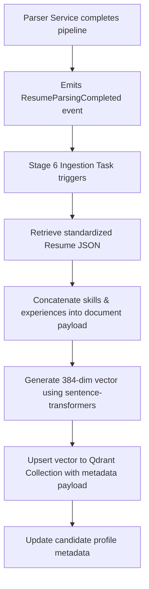

# Stage 6 Transition Plan: Resume Intelligence ML Engine

This document details the transition and integration roadmap between the **Stage 5 Resume Parsing Engine** and the upcoming **Stage 6: Machine Learning Resume Intelligence Engine**.

---

## 1. Context & Objectives

In Stage 6, the platform will consume the standardized **Resume JSON specification** created in Stage 5 to perform high-level machine learning and semantic evaluation:
- Generates high-dimensional vector embeddings representing candidate profiles.
- Upserts vectors to the **Qdrant Vector Database** (`candidates` collection) for fast semantic applicant-to-job matching.
- Performs resume score matching, semantic analysis of experience/projects, and candidate job suitability indexing.

---

## 2. Ingestion Flow & Vector Embedding Logic

The ML Resume Intelligence Engine acts as a downstream subscriber to DMS and parser events.



### Concatenation Template Example
For high-quality semantic embeddings, candidate skills and experiences are formatted into structured text strings:
```python
def prepare_embedding_text(resume_json: dict) -> str:
    parts = []
    # Add skills
    skills = [s["name"] for s in resume_json.get("skills", [])]
    parts.append("Skills: " + ", ".join(skills))
    
    # Add work experience
    for exp in resume_json.get("experience", []):
        parts.append(f"Work Experience: {exp.get('job_title')} at {exp.get('company')}. {exp.get('description')}")
        
    # Add education
    for edu in resume_json.get("education", []):
        parts.append(f"Education: {edu.get('degree')} from {edu.get('institution')}")
        
    return "\n".join(parts)
```

---

## 3. Qdrant Vector Collection & Semantic Queries

The candidate vector index schema in Qdrant:
- **Vector Dimension**: 384 (standard for `all-MiniLM-L6-v2` transformer model).
- **Payload Schema**:
  - `user_id`: UUID
  - `document_id`: UUID
  - `first_name`: String
  - `last_name`: String
  - `email`: String
  - `skills`: List of strings
  - `experience_years`: Float

Stage 6 will execute semantic search queries against Qdrant to calculate applicant matches.

---

## 4. Architectural Boundaries: ML Models

To prepare the project for Stage 6:
- Avoid adding heavy transformer dependency modules to the candidate REST service. The ML inference logic should run on a separate python worker (or using specialized microservice endpoints) to keep REST response latency low.
- Keep the Resume JSON structure as the single source of truth; do not introduce ad-hoc text queries in other backend controllers.
