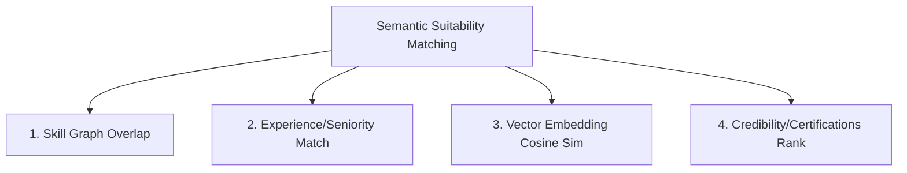

# Stage 7 Transition Plan: Semantic Matching Engine

This document details the transition and integration roadmap between the **Stage 6 Candidate Intelligence Profile** and the upcoming **Stage 7: Job Description Intelligence & Semantic Matching Engine**.

---

## 1. Context & Objectives

In Stage 7, the platform will introduce the Job Description (JD) Intelligence Engine and a high-accuracy Semantic Matching Engine.
- **JD Intelligence Engine**: Parses incoming Job Descriptions to extract required skills, experience thresholds, preferred credentials, and role locations.
- **Semantic Matching Engine**: Compares the Candidate Intelligence Profile (from Stage 6) with the Job Intelligence Profile using vector embeddings, Qdrant searches, and graph overlaps to calculate match scores and suitability rankings.

---

## 2. Profile Alignment & Matching Metrics

Stage 7 will calculate suitability across four key dimensions:

### Matching Algorithm Parameters

1. **Skill Graph Overlap**: Evaluates candidates' intersected skill graphs against the job description's taxonomy requirement.
2. **Experience Alignment**: Asserts total/relevant experience months against JD minima (e.g. raises warnings if a senior job receives a junior profile).
3. **Vector Similarity (Qdrant)**: Computes the cosine similarity between candidate features embeddings and the job description embedding in Qdrant.
4. **Weighted Scoring Model**:
   - `Final Match Score = (0.40 * Cosine Similarity) + (0.30 * Skill Overlap) + (0.20 * Experience Match) + (0.10 * Certification Match)`.

---

## 3. Database & Qdrant Schema Integration

1. **`job_intelligences` table**: Holds structured requirements extracted from the JD.
2. **Qdrant Vector Indexing**:
   - Both candidates and jobs will have 384-dimensional vector embeddings generated using sentence-transformers (e.g. `all-MiniLM-L6-v2`).
   - Standard queries: `qdrant_client.search(collection_name="candidates", query_vector=job_embedding)`.

---

## 4. Key Implementation Rules in Stage 7

- Maintain decoupled entities: candidate intelligence and job intelligence should remain independent until matching endpoints are invoked.
- Ensure that the matching calculations are fast (e.g. utilizing Redis to cache match scores and pre-computed features).
